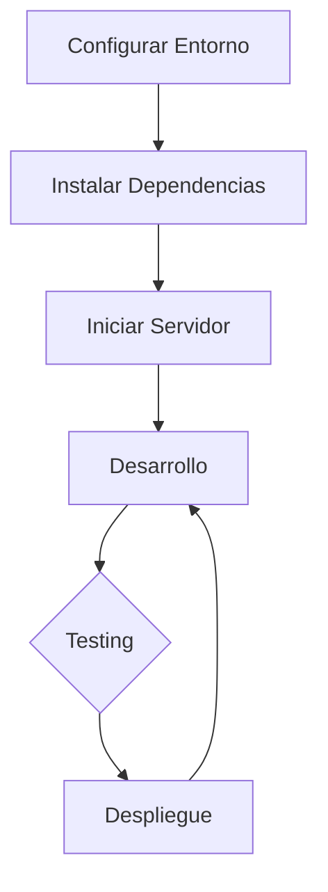
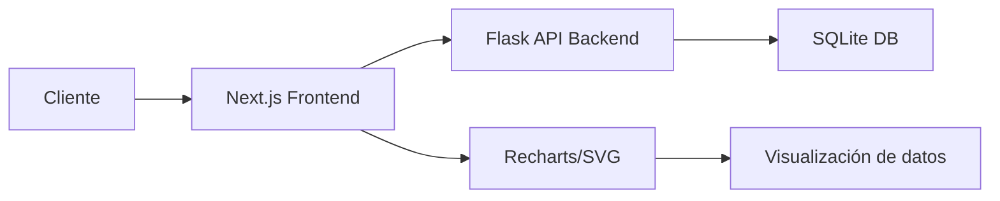

# 📦 Prototipo - Sistema de Gestión de Inventario

## 🚀 Características Principales

### 📋 Gestión de Productos

- Catálogo completo de productos con búsqueda y filtrado
- Control de stock mínimo y alertas automáticas
- Seguimiento de ubicaciones y proveedores
- Estados de calidad y trazabilidad

### 📊 Reportes y Análisis

- Dashboards interactivos con métricas clave
- Visualización de distribución de inventario
- Alertas de stock por categoría
- Exportación de informes en múltiples formatos

### 📉 Movimientos de Inventario

- Registro detallado de entradas, salidas y ajustes
- Historial completo de transacciones
- Filtrado por tipo, fecha y usuario
- Trazabilidad completa de productos

### 👥 Control de Acceso

- Sistema de autenticación seguro
- Gestión de usuarios y roles
- Permisos diferenciados por función
- Registro de actividades y auditoría

## 🛠️ Requisitos Previos

- Node.js (v18 o superior)
- PNPM (última versión)
- Navegador web moderno
- Backend API (incluido en el repositorio separado)

**NOTA:** Se han usado Mdatos mock para el prototipo pero el Login y la sesión de Gestión de Productos sí están conectados con el backend.

## 💻 Instalación

### 1. Instalar PNPM (si no lo tienes instalado)

```bash
npm install -g pnpm@latest
```

### 2. Instalar dependencias

```bash
pnpm i
```

### 3. Configurar variables de entorno

Crea un archivo `.env.local` en la raíz del proyecto con las siguientes variables:

```
NEXT_PUBLIC_API_URL=http://localhost:5000
```

> **Nota**: Ajusta la URL de la API según corresponda al entorno.

### 5. Iniciar el servidor de desarrollo

```bash
pnpm run dev
```

### 6. Acceder a la aplicación

Abre el navegador en:

```
http://localhost:3000
```

## 🔐 Credenciales de Prueba

Para acceder al sistema de prueba:

- Email: `usertesting@qpalliance.co`
- Contraseña: `TestingQp#1`

## 📝 Scripts Disponibles

```bash
# Desarrollo con verificación de sintaxis y compilación
pnpm dev

# Construcción para producción
pnpm build

# Iniciar versión de producción
pnpm start

# Verificar sintaxis
pnpm lint

# Limpiar archivos temporales
pnpm clean
```

## 🔄 Flujo de Trabajo



## 🏢 Arquitectura del Sistema



## 📚 Integración con Backend

Este frontend está diseñado para funcionar con una API RESTful desarrollada en Flask/Python. Asegúrate de tener el backend en funcionamiento con la base de datos correctamente inicializada.

### Endpoints principales:

- `/api/v1/products` - Gestión de productos
- `/api/v1/movements` - Movimientos de inventario
- `/api/v1/categories` - Categorías de productos
- `/api/v1/suppliers` - Proveedores
- `/api/v1/auth` - Autenticación y usuarios

## 🌐 Enlaces Útiles

- [Documentación de la API](http://localhost:5000/api/docs) (Disponible cuando el backend está en ejecución)
  
  

## 👨‍💻 Desarrollo

Este proyecto utiliza:

- TypeScript para tipado estático
- Tailwind CSS para estilos
- Shadcn/UI para componentes
- Recharts para visualizaciones
- Context API para estado global

# 
